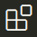

.. slide::

Configuration de l'Environement de Développement (IDE) VSCode
============

.. |python| image:: images/python.png
    :width: 24

.. slide::

Configuration des extensions
----------------------------

.. step::
    Ouvrez Visual Studio Code puis, cliquez sur l'icône des extensions |extension| dans la barre latérale ou appuyez sur ``Ctrl+Shift+X``.

|python|Python
~~~~~~~~~~~~~~~
.. step:: 
    Recherchez Python et installez l'extension développée par Microsoft.

Cette extension vous permettra de bénéficier de toutes les fonctionnalités de l'IDE pour le langage Python.

|autoDoc|autoDocstring
~~~~~~~~~~~~~~~~~~~~~~~
.. step::
    Recherchez autoDocstring et installez l'extension développée par Nils Werner.

Cette extension vous permettra de générer automatiquement la structure de la documentation de vos fonctions et méthodes Python.

|python|Black Formatter
~~~~~~~~~~~~~~~~~~~~~~~

.. step::
    Recherchez Black Formatter et installez l'extension développée par Microsoft.

Cette extension vous permettra de formater automatiquement votre code Python selon les règles de style définies par Black (règles de formattage standard de Python).
