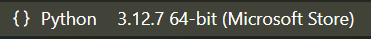

Facultatif - Installation sur votre machine personnelle
========================================================

Windows
-------

Installation de Python
~~~~~~~~~~~~~~~~~~~~~~

Pour installer Python sur Windows, la façon la plus simple est de l'installer depuis le Microsoft Store en suivant ce lien : `https://apps.microsoft.com/detail/9ncvdn91xzqp?ocid=webpdpshare <https://apps.microsoft.com/detail/9ncvdn91xzqp?ocid=webpdpshare>`_

Installation de VSCode
~~~~~~~~~~~~~~~~~~~~~~

De la même manière, vous pouvez installer Visual Studio Code depuis le Microsoft Store en suivant ce lien : `https://apps.microsoft.com/detail/xp9khm4bk9fz7q?ocid=webpdpshare <https://apps.microsoft.com/detail/xp9khm4bk9fz7q?ocid=webpdpshare>`_

Linux
-----

Installation de Python
~~~~~~~~~~~~~~~~~~~~~~

Par défaut Python est installé sur la plupart des distributions Linux. Pour vérifier si Python est installé sur votre machine, ouvrez un terminal et tapez la commande suivante : ``python --version`` ou ``python3 --version``. Si Python est installé, vous devriez voir la version de Python installée sur votre machine. Si Python n'est pas installé, vous pouvez l'installer en utilisant le gestionnaire de paquets de votre distribution.

Pour éviter d'avoir à jongler entre ``python`` et ``python3`` vous pouvez installer le paquet ``python-is-python3`` qui permet de lier ``python`` à ``python3`` avec la commande suivante :

.. code-block:: bash
    sudo apt install python-is-python3

Installation de VSCode
~~~~~~~~~~~~~~~~~~~~~~

Allez sur le site de Visual Studio Code : `https://code.visualstudio.com/ <https://code.visualstudio.com/>`_

Pour les distributions basées sur Debian (Ubuntu, Linux Mint, etc.), vous pouvez télécharger le fichier .deb et l'installer en utilisant la commande suivante : 

.. code-block:: bash
    sudo dpkg -i code_1.XX.X-XXXXXXXX_amd64.deb

A la fin de l'installation vous pouvez accepter d'ajouter VSCode à votre apt repository pour pouvoir le mettre à jour automatiquement.

Pour les autres distributions Linux, consultez la documentation de Visual Studio Code pour obtenir des instructions d'installation.

Optionnel - Avoir plusieurs versions de Python sur votre machine
----------

Si plusieurs version de Python sont installées sur votre machine, vous devez spécifier quelle version de Python vous souhaitez utiliser dans votre IDE.  
En effet, lorsqu'un fichier Python est ouvert, **en bas à gauche de l'interface de VSCode**, vous pouvez voir la version de Python que vous utilisez : |python_version|

Si vous avez plusieurs versions de Python installées, vous pouvez cliquer sur cette version pour choisir la version que vous souhaitez utiliser.

**Sous Windows**, la version par défaut est la dernière version de Python installée venant du Microsoft Store tel que présenté ci dessous :

.. center::
    .. image:: images/vscode_python_version_choice_win.png
        :alt: Choix de la version de Python

**Sous Linux**, la version par défaut est la version de Python installée par défaut sur votre distribution (Ici Python 3.12 pour Ubuntu 24.04) :

.. center::
    .. image:: images/vscode_python_version_choice_linux.png
        :alt: Choix de la version de Python

Avoir plusieurs version de Python sur votre machine peut être utile pour tester la compatibilité de votre code avec différentes versions de Python.

.. note::
    Attention, **changer cette version ne change pas la version de Python utilisée dans le terminal de VSCode.** 
    Elle change uniquement la version de Python utilisée pour l'exécution du code en cliquant sur le bouton "Run" ou "Debug" de VSCode. Elle permet à votre IDE de savoir quelle version de Python utiliser pour les fonctionnalités telles que l'autocomplétion, la vérification de syntaxe, etc.

    Pour changer la version de Python utilisée dans le terminal de VSCode, vous devez ouvrir un terminal dans VSCode et taper la commande suivante : ``python3.8`` ou ``python3.9`` par exemple.

Il est aussi possible de créer des "environnements virtuels" pour isoler les dépendances de vos projets. Cela permet de travailler sur plusieurs projets avec des versions de Python différentes sans que les dépendances d'un projet n'interfèrent avec un autre projet. Cela ne sera pas traité dans ce cours mais vous pouvez consulter la documentation officielle de Python pour plus d'informations : `https://docs.python.org/3/library/venv.html <https://docs.python.org/3/library/venv.html>`_